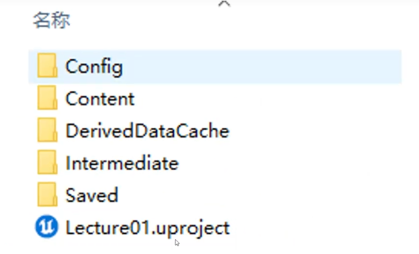
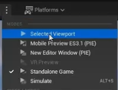

##  项目文集夹结构
- Config: 关于工程的配置信息
- Content：模型、贴图、音频、动画、粒子、蓝图等资源（后缀.uasset）
- DerivedDataCache：从<strong>原始资源文件</strong>中派生的数据，用于优化程序性能及加载时间
- Intermediate ：<strong>构建、编译</strong>或其他一些处理过程中产生的临时文件(可以删除)
- Saved：备份文件、日志文件、游戏状态保存等临时文件或用户特定文件
  

## 运行游戏
- SelectedViewport：当前选定的视口运行游戏
- MobilePreview(PIE)：使用手机模拟器运行游戏
- New Editor Window(PIE)：使用独立窗口运行游戏 
- **StandaloneGame**：不在编辑器环境下，<strong>独立运行游戏进程</strong>
-  Simulate：用于在编辑器内部模拟游戏世界的行为，而不实际"玩"游戏

*[PIE]: Play In Editor