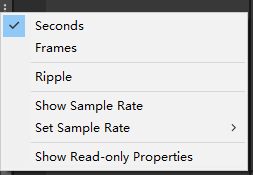

## Animation动画窗口

### 打开Animation窗口
Window —> Animation —> Animation

### Animation窗口作用
Animation窗口直译就是动画窗口,它主要用于在Unity内部创建和修改动画,所有在场景中的对象都可以通过Animation窗口为其制作动画。  

原理：  
制作动画时：记录在固定时间点对象挂载的脚本的变量变化。  
播放动画时：将制作动画时记录的数据在固定时间点进行改变，产生动画效果。

### 关键词说明
==动画时间轴==：每一个动画文件都有自己的一个生命周期，从动画开始到结束,我们可以在动画时间轴上编辑每一个动画生命周期中变化。  
==动画中的帧==：假设某个动画的帧率为60帧每秒，意味着该动画1秒钟最多会有60次改变机会,每一帧的间隔时间是 1s/60 ≈ 16.67毫秒,也就是说 我们最快可以每16.67毫秒改变一次对象状态。  
==关键帧==:动画在时间轴上的某一个时间节点上处于的状态。

### Animation窗口功能

 

[Ripple edit 介绍](https://www.homebrewaudio.com/8727/what-is-ripple-editing/)

## 创建编辑Animation动画
1. 在场景中选中想要创建动画的对象
1. 在场景中选中想要创建动画的对象
2. 在Animation窗口中点击创建
3. 选择动画文件将要保存到的位置

保存动画文件时，Unity会帮助我们完成以下操作  

1. 创建一个 Animator Controller（动画控制器或称之为动画状态机） 资源（新动画系统）(.controller)
2. 将新创建的动画文件(.anim)添加到Animator Controller中
3. 为动画对象添加Animator脚本组件
4. 为Animator组件关联创建的Animator Controller文件

##  动画文件参数

[官方文档WrapModel](https://docs.unity3d.com/ScriptReference/WrapMode.html)

