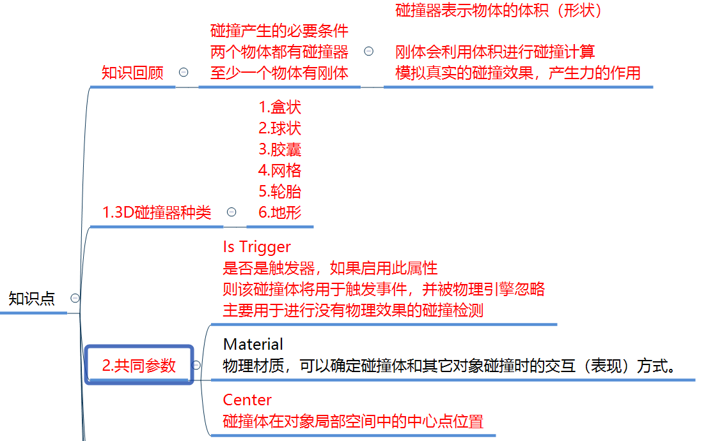

## 刚体
{ loading=lazy }
{ loading=lazy }
{ loading=lazy align=right }

## 碰撞器
{ loading=lazy }
{ width="670" align=right loading=lazy }  
{ align=right loading=lazy }
{ loading=lazy }
{ loading=lazy }
!!! 小结
    1. 网格碰撞器性能开销大，碰撞检测比较准确，不常用于商业项目。
    2. 轮胎碰撞器适用于赛车游戏。
    3. 地形碰撞器性能不好，不常用与商业项目。

## 物理材质
{ loading=lazy }
!!! tip 
    一般用于小游戏，不用于大型商业游戏。

!!! question 
    1. 如何让两个游戏物体之间产生碰撞（至少1个刚体 和 两个碰撞器）  
    2. 如何让两个物体之间碰撞时表现出不同效果（物理材质）  
    3. 触发器的作用是什么(让两个物体碰撞没有物理效果，只进行碰撞处理)  

## 碰撞检测函数
!!! tip 
    碰撞和触发响应函数属于特殊的生命周期函数,也是通过反射调用
### 物理碰撞检测响应函数

``` c#
//碰撞触发接触时会 自动执行这个函数
private void OnCollisionEnter(Collision collision)
{
    //Collision类型的 参数 包含了 碰到自己的对象的相关信息

    //关键参数
    //1.碰撞到的对象碰撞器的信息
    collision.collider

    //2.碰撞对象的依附对象（GameObject）
    collision.gameObject

    //3.碰撞对象的依附对象的位置信息
    collision.transform

    //4.触碰点数相关
    collision.contactCount

    //接触点 具体的坐标
    ContactPoint[] pos = collision.contacts;
    //只要得到了 碰撞到的对象的 任意一个信息 就可以得到它的所有信息
    
    print(this.name + "被" + collision.gameObject.name + "撞到了");
}

//碰撞结束分离时  会自动执行的函数
private void OnCollisionExit(Collision collision)
{
    print(this.name + "被" + collision.gameObject.name + "结束碰撞了");
}

//两个物体相互接触摩擦时 会不停的调用该函数
private void OnCollisionStay(Collision collision)
{
    print(this.name + "一直在和" + collision.gameObject.name + "接触");
}
```

### 触发器检测响应函数
``` c#
protected virtual void OnTriggerEnter(Collider other)
{
    print(this.name + "被" + other.gameObject.name + "触发了");
}

//触发结束的函数 当相融的状态结束时 会调用一次
private void OnTriggerExit(Collider other)
{
    print(this.name + "被" + other.gameObject.name + "结束相融的状态了");
}

//当两个对象子相融的时候 会不停调用
private void OnTriggerStay(Collider other)
{
    print(this.name + "和" + other.gameObject.name + "正在相融");
}
```

### 要明确什么时候会响应函数
1. 只要挂载的对象 能和别的物体产生碰撞或者触发 那么对应的这6个函数 就能够被响应
2. 6种函数一般是根据需求来进行选择书写
3. 如果是一个异形物体，刚体在父对象上，如果你想通过子对象上挂脚本检测碰撞是不行的，必须挂载到这个刚体父对象上才行
4. 要明确 物理碰撞和触发器响应的区别

!!! tip "碰撞和触发器函数都可以写成虚函数 在子类去重写逻辑"
    一般会把想要重写的碰撞和触发函数写成保护类型的,没有必要写成public,因为不会自己手动调用,都是Unity通过反射帮助我们自动调用的。

## 刚体加力

### 刚体自带添加力的方法
给刚体加力的目标就是：让其有一个速度 朝向某一个方向移动
``` C#
//1.首先应该获取刚体组件
rigidBody = this.GetComponent<Rigidbody>();

//2.添加力 相对世界坐标
//世界坐标系 Z轴正方向加了一个力
//加力过后 对象是否停止移动 是由阻力决定的
//如果阻力为0 那给了一个力过后 始终 是不会停止运动
rigidBody.AddForce(Vector3.forward * 10);
//如果想要在 世界坐标系方法中 让对象 相对于自己的面朝向动
rigidBody.AddForce(this.transform.forward * 10);

//相对本地坐标
rigidBody.AddRelativeForce(Vector3.forward * 10);


//3.添加扭矩力，让其旋转
//相对世界坐标
rigidBody.AddTorque(Vector3.up * 10);
//相对本地坐标
rigidBody.AddRelativeTorque(Vector3.up * 10);

//4.直接改变速度
//这个速度方向 是相对于 世界坐标系的 
//如果要直接通过改变速度 来让其移动 一定要注意这一点
rigidBody.velocity = Vector3.forward * 5;

//5.模拟爆炸效果
//模拟爆炸的力 一定是 所有希望产生爆炸效果影响的对象 
//都需要得到他们的刚体 来执行这个方法 才能都有效果
rigidBody.AddExplosionForce(100, Vector3.zero, 10);

```

### 力的几种模式
``` C#
//第二个参数 力的模式 主要的作用 就是 计算方式不同而已 
rigidBody.AddForce(Vector3.forward * 10, ForceMode.Acceleration);
```
!!! note "动量定理"
    
    $$ Ft=mv $$
    F:力  t：时间  m:质量 v:速度

!!! info "模式"
    === "Acceleration"
        给物体增加一个持续的加速度，忽略其质量  

        - v = Ft / m
        - F: (0, 0, 10)
        - t: 0.02s
        - m: 默认为1
        - v = 10 * 0.02 / 1 = 0.2m/s
        - 每物理帧移动0.2m / s * 0.02 = 0.004m
    === "Force"
        给物体添加一个持续的力，与物体的质量有关

        - v = Ft / m
        - F: (0, 0, 10)
        - t: 0.02s
        - m: 2kg
        - v = 10*0.02 / 2 = 0.1m/s
        - 每物理帧移动0.1m/s*0.02 = 0.002m
    === "Impulse"
        给物体添加一个瞬间的力，与物体的质量有关,忽略时间
                
        - v = Ft/m
        - F: (0, 0, 10)
        - t: 默认为1
        - m: 2kg
        - v = 10*1/ 2 = 5m/s
        每物理帧移动5m/s*0.02 = 0.1m
    === "VelocityChange"
        给物体添加一个瞬时速度，忽略质量，忽略时间  
        
        - v = Ft/m
        - F: (0, 0, 10)
        - t: 默认为1
        - m: 默认为1
        - v = 10*1 / 1 = 10m/s
        - 每物理帧移动10m/s*0.02 = 0.2m

### 力场脚本
给予一个物体一直的力，或者扭矩力，可以减少代码书写
{ loading=lazy }

### 刚体休眠
我们在开发的时候会遇到这个问题：两个带有刚体和collider的静止物体相互接触，在挂有OnCollisionStay()函数中debug，只有程序刚运行的时候会有二十多个log，之后就再也没有输出。原以为是unity版本bug，后来查询资料发现这是unity的优化机制。

When a Rigidbody moves at a slower speed than the Sleep Threshold (see the Physics Project Settings), Unity sets the Rigidbody to “sleep”, which means that the physics system does not include it in physics calculations. When a sleeping Rigidbody receives a collision or force, Unity “wakes up” the Rigidbody and continues to include it in physics calculations. 
  
--- 

当刚体以低于睡眠阈值的速度移动时（请参阅物理项目设置），Unity将刚体设置为“睡眠”，这意味着物理系统不将其包括在物理计算中。当睡眠中的刚体受到碰撞或力时，Unity会“唤醒”刚体，并继续将其包含在物理计算中。

Edit -> Project Settings -> Physics ->  Sleep Threshold
{ loading=lazy }

unity让此刚体休眠，不在将对他进行物理计算，节省性能。当休眠的刚体接收到碰撞或者外力，unity就唤醒刚体开始继续计算了。所以就不难理解了，上面的测试log只有二十多个。

``` C#
//获取刚体是否处于休眠状态 如果是 
if (rigidBody.IsSleeping())
{
    //就唤醒它
    rigidBody.WakeUp();
}
```

??? question "请问现在让一个物体产生位移有几种方式？"
    1. 直接在Update生命周期函数中 改变Transform当中的Position属性
    2. 直接在Update生命周期函数中 使用Transform提供的API Translate这个方法
    3. 通过对刚体加力 rigidBody.AddForce || rigidBody.AddRelativeForce
    4. 通过改变刚体的速度 rigidBody.velocity