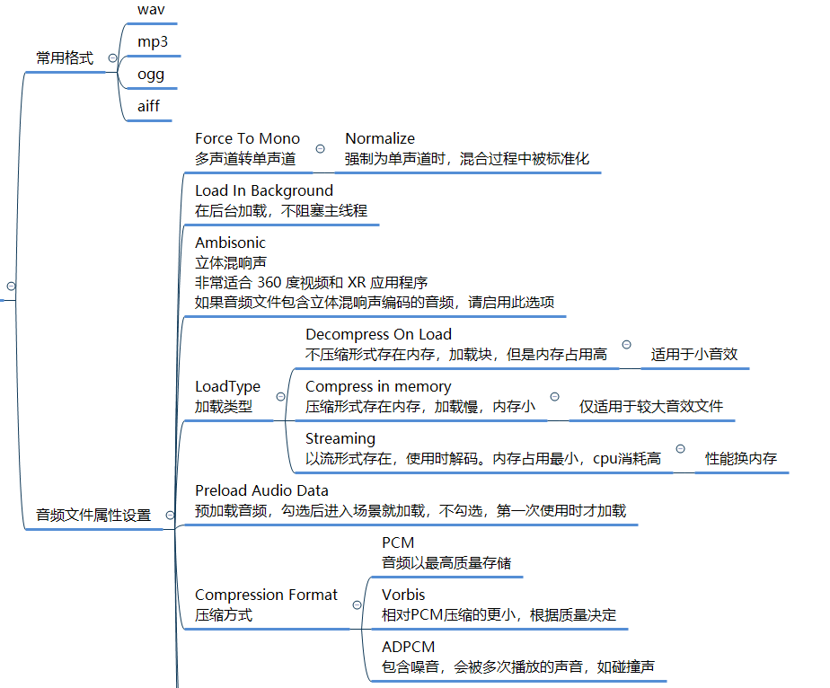
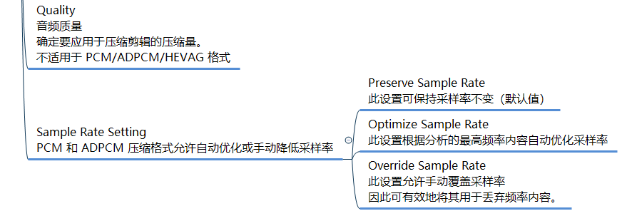
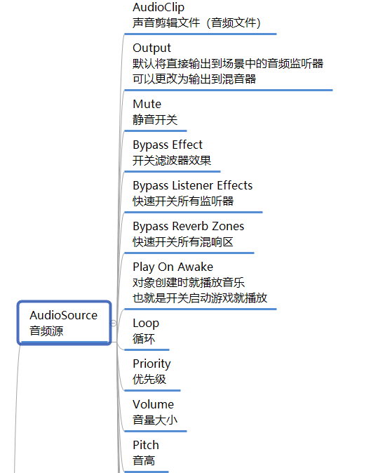

## 音频文件导入

### Unity中常用格式
!!! info "常用音频格式"
    === "WAV"
        Format type: Uncompressed lossless

        WAV (Waveform Audio File Format) — an uncompressed lossless audio format developed by IBM and Microsoft, and a gold standard in studio recording. WAV files recreate the original source audio at the highest quality with no loss whatsoever, making it ideal for sound engineers. On top of having a great bit depth and dynamic range, the WAV format holds embedded time code which makes for precise synchronization useful for collaborative projects. Most audio players and devices support the format and can play WAV files without any problem. The only downside is that the file sizes are quite large, so much so that sometimes it isn’t practical to convert and store files in this format unless you need to restore, edit or manipulate audio.

        ---
        格式类型：未压缩无损

        (Waveform Audio File Format) —— 一种由{==IBM和微软==}开发的未压缩无损音频格式，是录音室录音的黄金标准。WAV文件以最高质量再现原始源音频，不会有任何损失，是声音工程师的理想选择。WAV格式除了具有强大的比特深度和动态范围外，还包含嵌入的时间代码，这使得精确同步对协作项目非常有用。大多数音频播放器和设备都支持这种格式，并且可以毫无问题地播放WAV文件。唯一的缺点是文件大小很大，以至于有时以这种格式转换和存储文件是不现实的，除非你需要恢复、编辑或操作音频。
    === "AIFF"
        Format type: Uncompressed lossless

        AIFF (Audio Interchange File Format) — an audio file format standard created by Apple. Similar to WAV, it offers the highest possible audio quality and sound replication. AIFF stores data in uncompressed lossless format with no quality loss, retaining the original sound as is. There is a slight difference in the way AIFF and WAV files are created, though it doesn’t reflect on the sound. Both formats store CD-quality audio (16-bit, 44.1kHz) which also means that AIFF files, just like WAV, take a lot of space — around 10MB of the hard drive per minute in length.

        If you decide on which of the two formats to use for editing and mixing, WAV could prove to be more useful since AIFF doesn’t hold time codes. But otherwise, you will get the exact same superb audio quality with either of them.

        ---

        格式类型：未压缩无损

        AIFF（音频交换文件格式）—— 一种由{==苹果==}公司创建的音频文件格式标准。与WAV类似，它提供了尽可能高的音频质量和声音复制。AIFF以无质量损失的未压缩无损格式存储数据，保留原始声音。AIFF和WAV文件的创建方式略有不同，但不会反映在声音上。这两种格式都存储CD质量的音频（16位，44.1kHz），这也意味着AIFF文件，就像WAV一样，占用了很大的空间——每分钟大约10MB的硬盘。

        如果您决定使用这两种格式中的哪一种进行编辑和混合，WAV可能会更有用，因为AIFF不包含时间代码。但除此之外，您将使用它们中的任何一个获得完全相同的卓越音频质量。
    === "MP3"
        Format type: Compressed lossy

        MP3 (MPEG Audio Layer 3) — the most popular lossy format. MP3 is the default audio format for many music providers and video platforms today. MP3 became a staple of the Internet era due to the capability to compress files to very small sizes (as small as one-tenth of the size of lossless files) while still maintaining relatively high sound quality. For the consumer, the quality of MP3 files seems fine but audio engineers and producers usually abstain from dealing with the format. Compression to MP3 permanently deletes audio information that cannot be properly recovered, especially so when it comes to bit depth. Recording and mixing music requires at least 24-bit or higher, while MP3 files are only up to 16-bit.

        ---

        格式类型：压缩有损

        MP3（MPEG音频层3）—— 最流行的有损格式。MP3是当今许多音乐提供商和视频平台的默认音频格式。MP3之所以成为互联网时代的主流，是因为它能够将文件压缩到非常小的大小（小到无损文件大小的十分之一），同时仍然保持相对较高的音质。对于消费者来说，MP3文件的质量似乎很好，但音频工程师和制作人通常不会处理这种格式。压缩到MP3会永久删除无法正确恢复的音频信息，尤其是在比特深度方面。录制和混音音乐至少需要24位或更高的比特，而MP3文件最多只能使用16位。

    === "OGG"
        Format Type: Compressed lossy

        OGG — a free open-source audio format developed by Xiph.Org Foundation. It has a container for Vorbis, Theora, Speex, Opus, etc. The compression bitrate varies depending on the requirement of the file. Since OGG is a lossy audio format, some data from the original is irretrievably lost after the compression, so it’s no match to FLAC, WAV or AIFF. However, in comparison to MP3, OGG is superior in sound quality and file size alike. It’s not as popular, but if your device supports OGG, it’s better to pick OGG over MP3 because of smaller file size, higher bitrate and overall audio quality.

        ---

        格式类型：压缩有损

        OGG —— 由Xiph.Org基金会开发的免费开源音频格式。它有一个Vorbis,Theora,Speex,Opus等的容器。压缩比特率取决于文件的需求。由于OGG是一种有损音频格式，在压缩后，原始数据会不可恢复地丢失，所以它无法与FLAC,WAV或AIFF相匹敌。然而，与MP3相比，OGG在音质和文件大小方面都更优越。它不那么流行，但如果你的设备支持OGG，那么你最好选择OGG而不是MP3，因为它文件大小更小，比特率更高，整体音质更好。

### 音频文件属性设置



官方文档AudioClipLoadType：[AudioClipLoadType](https://docs.unity.cn/cn/2020.3/ScriptReference/AudioClipLoadType.html)


## 音频源和音频监听脚本


多普勒效应：[多普勒效应](https://zh.wikipedia.org/wiki/%E5%A4%9A%E6%99%AE%E5%8B%92%E6%95%88%E5%BA%94)

!!! tip 
    注意3D模式的音频受空间远近的影响哦！！！

## 代码控制音频源

### 代码控制播放

!!! note 
    === "播放音效"
        ``` C#
        audioSource.Play();
        //延时播放
        audioSource.PlayDelayed(0.5f);
        ```
    === "停止音效"
        ``` C#
        audioSource.Stop();
        ```
    === "暂停音效"
        ``` C#
        audioSource.Pause();
        ```
    === "恢复播放"
        ``` C#
        audioSource.UnPause();
        ```
        恢复播放和暂停后Play的效果是一样的，都会继续播放当前的音效

### 检测音效播放完毕
``` C#
//如果你希望某一个音效播放完毕后 想要做什么事情
//那就可以在Update生命周期函数中 不停的去检测 它的 该属性
//如果是false就代表播放完毕了
if(audioSource.isPlaying)
{
    print("播放中");
}
else
{
    print("播放结束");
}
```

### 如何动态控制音效播放
1. 直接在要播放音效的对象上挂载脚本控制播放
2. 实例化挂载了音效源脚本的对象(用的比较少，还要控制对象的销毁，比较麻烦)
3. 用一个AudioSource来控制播放不同的音效
    ```C#
    AudioSource aus = this.gameObject.AddComponent<AudioSource>();
    aus.clip = clip;
    aus.Play();
    ```
!!! tip 潜在知识点
    一个GameObject可以挂载多个音效源脚本AudioSource，使用时要注意，如果要挂载多个那一定要自己管理他们，控制他们的播放、停止,不然我们没有办法准确的获取想要的哪个。

## 麦克风输入相关

### 获取设备麦克风信息
``` C#
string[] strs = Microphone.devices;
for (int i = 0; i < strs.Length; i++)
{
    print(strs[i]);
}
#endregion
```

### 开始录制
``` C#
//参数一：设备名 传null使用默认设备
//参数二：超过录制长度后 是否重头录制
//参数三：录制时长
//参数四：采样率
clip = Microphone.Start(null, false, 10, 44100);
```

### 结束录制
``` C#
Microphone.End(null);
```

### 获取音频数据用于存储或者传输
``` C#
//规则 用于存储数组数据的长度 是用 声道数 * 剪辑长度
float[] f = new float[clip.channels * clip.samples];
clip.GetData(f, 0);
print(f.Length);
```
